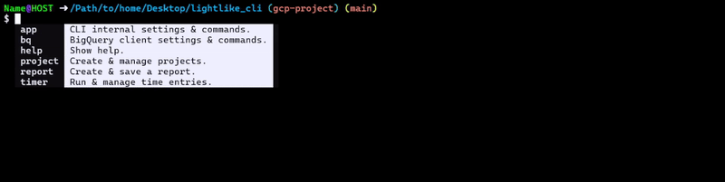
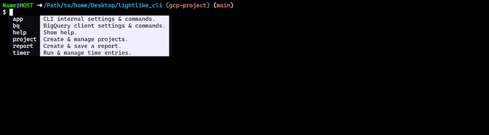
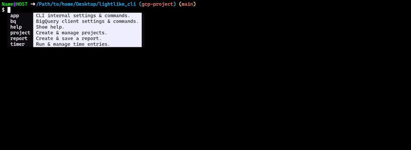
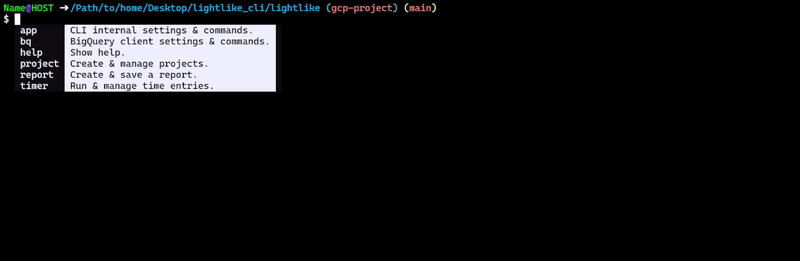

<!-- markdownlint-disable MD033 -->

# Lightlike-CLI

A time-tracking REPL, using [Google BigQuery](https://cloud.google.com/bigquery?hl=en) as a backend.



To see a brief overview of features, skip to the [Features](#features) section below.

For a full list of commands, see the [Command Guide](https://github.com/ayvi-0001/lightlike-cli/blob/main/docs/command_guide.md).

---

## Features

- **Aliased commands & Auto Completion.**
  
  The primary goal of this tool is to make logging hours as fast as possible.
  All commands are aliased - if no other command begins with the same characters,
  then you can simple type the first character to use that command. All flags also have a short option.

  

  Previously entered notes also appear as autocompletions, to speed up future entries.
  
- **Concurrent/pausable timers.**

  You can have multiple time entries running at once, pausing and resuming as needed.

  

- **Summary reports/download.**

  Download summary reports as either an `svg` of the console output, `csv`, or `json`.

  

- **BigQuery Shell.**

  Write queries directly to BigQuery.\
  <span style="color:grey">***Note**: This is a very minimal feature shell, as it's not main focus of this tool*.</span>

  

- **Backup/restore snapshots.**

  Create and restore table snapshots right from the cli using the `bq snapshot` command.

- **Built-in commands.**

  Autocompletion for `cd`, `ls`, and `tree`.
  
  

---

## Installation & Setup

> [!IMPORTANT]  
> This CLI requires a connection to BigQuery. This can be either determined from the environment, or through a service account key.
>
> If the selected option is the latter - to avoid keeping a plain-text file on the local machine - the service account key is encrypted using a user-provided password.
>
> There is no option to save data locally. Support for SQLite is planned.
>
> This package is not currently hosted on PyPI. It may be uploaded in the future.

---

> [!NOTE]  
> These examples are creating a directory in the user's home path called `lightlike_cli`.
> Change the target directories if you want to create it somewhere else.
>
> They're also installing the package in a virtual environment, this is optional but recommended.

---

### Linux | Git Bash/Cygwin on Windows

```sh
mkdir ~/lightlike_cli
cd ~/lightlike_cli

virtualenv env
source env/bin/activate

pip install "lightlike-cli @ git+https://github.com/ayvi-0001/lightlike-cli@main"
```

### Windows

```sh
mkdir %USERPROFILE%/lightlike_cli
cd %USERPROFILE%/lightlike_cli

virtualenv env
env/Scripts/activate

pip install "lightlike-cli @ git+https://github.com/ayvi-0001/lightlike-cli@main"
```

As long as you are in the virutal environment, you should now be able to start the REPL by typing the command below.

```sh
lightlike
```

***Optional***: Create symbolic link on `$PATH`\
This step will only work if you're on Linux, or using Git Bash/Cygwin on Windows.\
The `mklink` command in Command Prompt will not work to create a symbolic link to a `.exe`.

### Linux

```sh
cd /usr/local/bin
sudo ln -s ~/lightlike_cli/env/bin/lightlike
```

### Git Bash/Cygwin

```sh
cd ~/Appdata/Local/Programs/Python/Python311/Scripts
ln -s ~/Desktop/lightlike_cli/env/Scripts/lightlike.exe
```

After running the commands above, you should be able to start the CLI using the command `$ lightlike` from anywhere, without needing to activate the virtualenv first.

There is a short initial setup the first time the CLI runs to configure default settings and set up authorization. This includes setting up the default timezone, and running scripts to build the required procedures/tables in BigQuery.

---

## Issues

This tool is not 100% complete and you may encounter bugs.
It's recommended to keep frequent backups of your time entries (primarily why the snapshot commands were added).

Please open an issue if you do encounter any.

As a reminder, if something happens resulting in a loss of data, without having created a recent snapshot -
As long as the table has not been dropped you can query a table's historical data from any point in time within the fail-safe period of the last 7 days by using the `FOR SYSTEM_TIME AS OF` clause.

E.g.

```sql
SELECT
  *
FROM
  `lightlike_cli.timesheet`
FOR SYSTEM_TIME AS OF
  TIMESTAMP(CURRENT_TIMESTAMP() - INTERVAL 12 HOUR);
```

---
