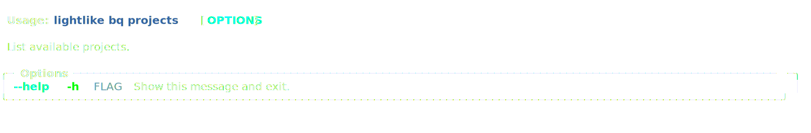
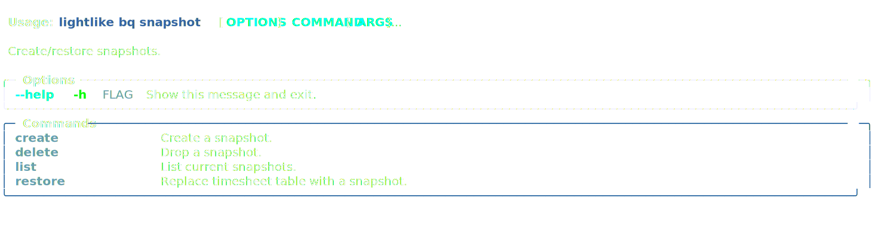
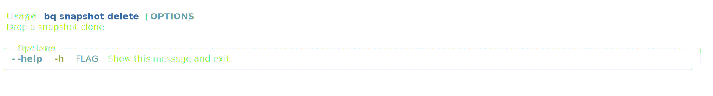
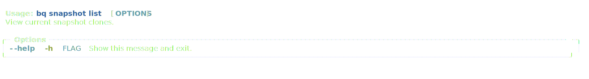
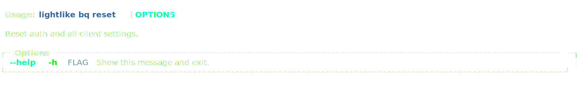

<!-- markdownlint-disable MD033 MD014 -->

# Command Guide

- [`general`](#general)
- [`timer`](#timer)
- [`project`](#project)
- [`report`](#report)
- [`app`](#app)
- [`bq`](#bq)

## `general`

## `timer`

### `timer:add`

### `timer:delete`

### `timer:edit:entry`

### `timer:edit`

### `timer:get`

### `timer:list`

### `timer:list:date`

### `timer:list:range`

### `timer:notes:update`

### `timer:pause`

### `timer:resume`

### `timer:run`

### `timer:show`

### `timer:stop`

### `timer:switch`

### `timer:update`

## `project`

- [`general`](#general)
- [`timer`](#timer)
- [`project`](#project)
- [`report`](#report)
- [`app`](#app)
- [`bq`](#bq)

### `project:archive`

### `project:create`

### `project:delete`

### `project:list`

### `project:unarchive`

### `project:update`

### `project:update:name`

### `project:update:description`

## `report`

- [`general`](#general)
- [`timer`](#timer)
- [`project`](#project)
- [`report`](#report)
- [`app`](#app)
- [`bq`](#bq)

### `report:csv`

### `report:json`

### `report:table`

## `app`

- [`general`](#general)
- [`timer`](#timer)
- [`project`](#project)
- [`report`](#report)
- [`app`](#app)
- [`bq`](#bq)

### `app:clear`

### `app:dev`

### `app:dev:config`

### `app:dev:dir`

### `app:dev:run-bq`

### `app:exit`

### `app:settings`

### `app:settings:update:general:editor`

### `app:settings:update:general:is:billable`

### `app:settings:update:general:note:history`

### `app:settings:update:general:stay:logged:in`

### `app:settings:update:general:timezone`

### `app:settings:update:general:week:start`

### `app:settings:update:query:hide_table_render`

### `app:settings:update:query:mouse_support`

### `app:settings:update:query:save_query_info`

### `app:settings:update:query:save_svg`

### `app:settings:update:query:save_txt`

### `app:sync`

### `app:test`

### `app:test:date-parse`

## `bq`

- [`general`](#general)
- [`timer`](#timer)
- [`project`](#project)
- [`report`](#report)
- [`app`](#app)
- [`bq`](#bq)

### `bq:init`

### `bq:projects`

### `bq:show`

### `bq:snapshot`

### `bq:snapshot:create`

### `bq:snapshot:delete`

### `bq:snapshot:list`

### `bq:snapshot:restore`

### `bq:reset`

